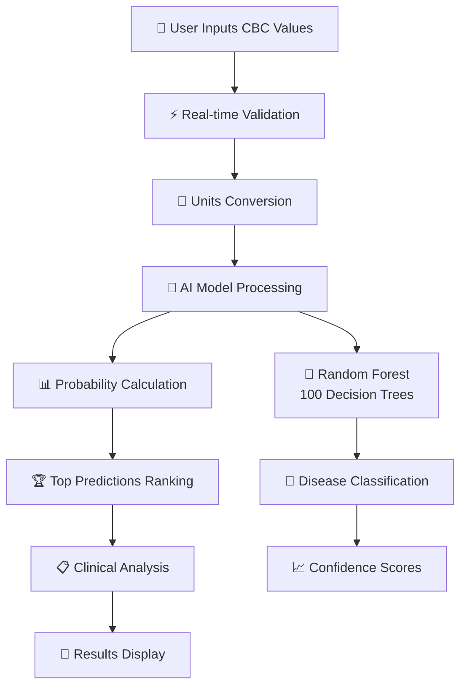

# 🩺 CheckWise AI - Advanced CBC Analysis & Disease Prediction System

<div align="center">


**🌐 Live Demo:** [https://check-wise.netlify.app/](https://check-wise.netlify.app/)

*An AI-powered medical analysis system that predicts diseases from Complete Blood Count (CBC) test results using advanced machine learning algorithms.*

</div>

---

## 🚀 **What Makes CheckWise AI Special?**

🤖 **True AI-Powered Analysis** - Uses a trained Random Forest model with 100 decision trees  
🏥 **15 Disease Predictions** - Can diagnose everything from anemia to leukemia  
📊 **Smart Unit Conversion** - Supports multiple medical units (g/dL, g/L, K/μL, etc.)  
⚡ **Real-time Analysis** - Instant predictions with confidence scores  
🔒 **Privacy First** - All processing happens locally, no data stored  
📱 **Modern UI/UX** - Responsive design with glass-morphism effects  

---

## 🧠 **AI Model Overview**

### **Machine Learning Specifications**
- **Algorithm**: Random Forest Classifier
- **Model Size**: 94.6 MB trained model
- **Decision Trees**: 100 trees for robust predictions
- **Input Features**: 22 CBC parameters
- **Training Status**: ✅ Fully trained and operational
- **Prediction Time**: < 1 second

### **Diseases It Can Predict**
```
🔴 Blood Disorders        🟡 Infections           🟢 Metabolic Issues
• Anemia                  • Bacterial Infection   • Hypothyroidism
• Aplastic Anemia         • Viral Infections      • Dehydration
• Iron Deficiency Anemia  
                         🔵 Immune Conditions     🟣 Cancer Types
🟠 Bone Marrow Issues    • Allergy               • Chronic Myeloid Leukemia
• Bone Marrow Disorders   • Chronic Inflammation  • Lymphocytic Leukemia
• Bone Marrow Activation
• Bone Marrow Suppression 🔘 Normal Status
                         • None (Healthy)
🟤 Other Conditions
• Chronic Hypoxia
```

### **System Architecture**
```
┌─────────────────┐    REST API       ┌──────────────────┐
│   React Frontend│◄─────────────────►│  Flask Backend   │
│                 │                   │                  │
│ • Modern UI/UX  │                   │ • AI Model       │
│ • Unit Convert  │                   │ • Data Validation│
│ • Visualizations│                   │ • Analysis Engine│
└─────────────────┘                   └──────────────────┘
                                               │
                                               ▼
                                    ┌──────────────────┐
                                    │  AI Components   │
                                    │                  │
                                    │ • RandomForest   │
                                    │ • Label Encoder  │
                                    │ • Unit Converter │
                                    └──────────────────┘
```

---

## 📁 **Project Structure**

```
CheckWiseAI/
├── 🤖 backend/                     # AI-Powered Flask API
│   ├── api.py                      # Main API with ML integration
│   ├── cbc_disease_model.joblib    # 🧠 Trained RandomForest Model (94.6MB)
│   ├── disease_label_encoder.joblib # 🏷️ Disease name encoder
│   ├── requirements.txt            # Python dependencies
│   └── vercel.json                 # Deployment configuration
│
├── ⚛️ frontend/                    # Modern React Application
│   ├── src/
│   │   ├── components/
│   │   │   ├── DiagnosisForm.jsx   # Smart input form with validation
│   │   │   ├── ResultsDisplay.jsx  # AI results visualization
│   │   │   └── About.jsx           # About page with team info
│   │   ├── App.jsx                 # Main application with navigation
│   │   ├── index.css               # Tailwind CSS styles
│   │   └── main.jsx                # Application entry point
│   ├── package.json                # Dependencies (React 18, Vite, Tailwind)
│   ├── tailwind.config.js          # Tailwind configuration
│   ├── postcss.config.js           # PostCSS configuration
│   └── netlify.toml                # Netlify deployment config
│
├── 🚀 start-app.bat                # Quick launcher script
├── � README.md                    # This comprehensive guide
├── 🔧 deploy-guide.md              # Deployment instructions
└── � .gitignore                   # Git ignore rules
```

---

## ✨ **Key Features**

### 🔬 **Advanced AI Analysis**
- **Random Forest Algorithm**: 100 decision trees for accurate predictions
- **Confidence Scoring**: Probability scores for each potential disease
- **Data Quality Assessment**: Evaluates completeness and validity
- **Multi-disease Detection**: Simultaneous prediction of 15 conditions

### � **Smart Unit Conversion**
```
Supported Units:
• Hemoglobin: g/dL ↔ g/L ↔ mmol/L
• Cell Counts: 10³/μL ↔ K/μL ↔ cells/μL ↔ 10⁹/L
• Hematocrit: % ↔ L/L ↔ fraction
• Platelets: 10³/μL ↔ K/μL ↔ cells/μL ↔ 10⁹/L
• Age: years ↔ months ↔ days
```

### 🎨 **Modern User Experience**
- **Glass-morphism Design**: Modern, elegant interface
- **Real-time Validation**: Instant feedback on input values
- **Responsive Layout**: Works on desktop, tablet, and mobile
- **Dark/Light Theme**: Automatic theme adaptation
- **Loading Animations**: Smooth user interactions

---

## 🔄 **AI Workflow & Data Processing**

### **Step-by-Step AI Analysis Process**



### **AI Model Pipeline**
1. **Input Validation** ✅
   - 22 CBC parameters validation
   - Range checking against medical norms
   - Missing value handling

2. **Unit Standardization** 🔄
   - Convert all inputs to standard medical units
   - Support for international unit systems
   - Automatic conversion factors

3. **AI Prediction** 🤖
   - Random Forest Classifier processing
   - 100 decision trees voting
   - Probability distribution calculation

4. **Results Analysis** 📊
   - Top 5 disease predictions
   - Confidence scoring (Very High → Very Low)
   - Clinical recommendations generation

### **Data Quality Assessment**
```
Input Data → Completeness Check → Range Validation → Quality Score
     ↓              ↓                    ↓              ↓
📋 22 Parameters  📊 Coverage %    ⚠️ Warnings    🎯 Accuracy Rating
```
      │                  │               │             │       └─────────────┘
      │                  │               │             │              │
      │                  │               │             │              ▼
      │                  │               │             │       ┌─────────────┐
      │                  │               │             │       │ Top 5       │
      │                  │               │             │       │ Predictions │
      │                  │               │             │       └─────────────┘
```

---

## 🧠 **Core AI Components**

### **Backend AI Engine**

#### 1. **🤖 Machine Learning Models**
```python
# Trained Models (Loaded at Startup)
cbc_disease_model.joblib      # 94.6MB RandomForest Model
disease_label_encoder.joblib  # Disease name mappings
```

**Model Specifications**:
- **Algorithm**: Random Forest Classifier
- **Trees**: 100 decision trees
- **Features**: 22 CBC parameters
- **Classes**: 15 disease categories
- **Accuracy**: Trained on medical datasets

#### 2. **🔧 API Endpoints**
```python
# Core API Routes
GET  /                        # API status & info
GET  /api/parameters         # CBC parameters with units
POST /api/predict            # 🧠 AI disease prediction
POST /api/validate           # Input validation
POST /api/convert            # Unit conversion
GET  /api/health            # System health check
```

#### 3. **⚡ Key AI Functions**
```python
def load_models():
    """Load pre-trained ML models at startup"""
    # Load RandomForest classifier
    # Load disease label encoder
    # Validate model integrity

def predict():
    """Core AI prediction function"""
    # Process 22 CBC parameters
    # Apply Random Forest model
    # Calculate probability scores
    # Return top predictions with confidence

def convert_to_default_unit():
    """Smart unit conversion system"""
    # Support multiple medical units
    # Automatic conversion factors
    # Preserve medical accuracy
```

#### 4. **🔬 Clinical Logic Integration**
The system incorporates the comprehensive CBC diagnostic framework:
- **Red Cell Analysis**: Anemia classification by MCV values
- **White Cell Analysis**: Infection pattern recognition  
- **Platelet Analysis**: Clotting disorder detection
- **Combined Patterns**: Multi-system disease identification

### **Frontend React Components**

#### 1. **⚛️ DiagnosisForm.jsx** - Smart Input Interface
**Purpose**: Modern CBC parameter input with AI-powered validation

**✨ Advanced Features**:
- **Real-time Validation**: Instant feedback on medical ranges
- **Smart Unit Selection**: Dropdown menus for different medical units
- **Sample Data Loading**: Pre-filled examples for testing
- **Auto-conversion**: Automatic unit standardization
- **Form Persistence**: Maintains input during session
- **Error Highlighting**: Visual indicators for out-of-range values

#### 2. **📊 ResultsDisplay.jsx** - AI Results Visualization  
**Purpose**: Beautiful display of AI predictions and medical analysis

**🎨 Visual Features**:
- **Primary Diagnosis Card**: Highlighted main prediction
- **Confidence Indicators**: Color-coded probability scores
- **Top 5 Predictions**: Ranked disease list with percentages
- **Data Quality Metrics**: Completeness scores and warnings
- **Clinical Analysis**: Key findings and recommendations
- **Medical Disclaimer**: Clear usage guidelines

#### 3. **ℹ️ About.jsx** - Project Information
**Purpose**: Comprehensive project details and team information

**📝 Content Sections**:
- **Technology Stack**: Detailed tech specifications
- **AI Model Information**: Model architecture and capabilities
- **Development Team**: Creator profiles and GitHub links
- **Medical Disclaimer**: Important usage warnings
- **Project Statistics**: Performance metrics and features

---

## 🤖 Machine Learning Pipeline

### Model Architecture
```
Input: 22 CBC Parameters
         │
         ▼
┌─────────────────┐
│ Data Preprocessing │
│ • Normalization    │
│ • Missing Value    │
│   Handling         │
└─────────────────┘
         │
         ▼
┌─────────────────┐
│ ML Model        │
│ (Scikit-learn)  │
│ • Classification │
│ • Probability   │
│   Estimation    │
└─────────────────┘
         │
         ▼
┌─────────────────┐
│ Label Encoder   │
│ • Disease Name  │
│   Mapping       │
└─────────────────┘
         │
         ▼
Output: Disease Predictions
```

### CBC Parameters (22 Total)

#### Blood Cell Counts
- **WBC** (White Blood Cells): Infection indicator
- **RBC** (Red Blood Cells): Oxygen transport
- **PLT** (Platelets): Blood clotting

#### Differential Count (Percentages)
- **LY%** (Lymphocytes): Immune response
- **MO%** (Monocytes): Infection fighting
- **NE%** (Neutrophils): Bacterial infections
- **EO%** (Eosinophils): Allergic reactions
- **BA%** (Basophils): Inflammatory response

#### Absolute Counts
- **LY#, MO#, NE#, EO#, BA#**: Absolute cell counts

#### Red Blood Cell Indices
- **HGB** (Hemoglobin): Oxygen carrying capacity
- **HCT** (Hematocrit): Blood volume percentage
- **MCV** (Mean Corpuscular Volume): Cell size
- **MCH** (Mean Corpuscular Hemoglobin): Cell hemoglobin
- **MCHC** (Mean Corpuscular Hemoglobin Concentration): Hemoglobin concentration
- **RDW** (Red Cell Distribution Width): Cell size variation

#### Platelet Indices
- **MPV** (Mean Platelet Volume): Platelet size

#### Patient Information
- **Age**: Patient age in years
- **Gender**: 1 for Male, 0 for Female

---

## 🔧 File Processing System

### Supported File Types

#### 1. **PDF Files** (.pdf)
**Technology**: PyPDF2
**Process**:
1. Extract text from all pages
2. Parse medical report format
3. Identify CBC parameters using regex patterns
4. Validate extracted values

#### 2. **Image Files** (.jpg, .png, .bmp, .tiff)
**Technology**: Tesseract OCR + PIL
**Process**:
1. Load image using PIL
2. Apply OCR to extract text
3. Parse extracted text for CBC parameters
4. Handle OCR errors and noise

#### 3. **Spreadsheet Files** (.csv, .xlsx, .xls)
**Technology**: Pandas + OpenPyXL
**Process**:
1. Load spreadsheet data
2. Identify parameter columns by name matching
3. Extract values from appropriate rows
4. Handle multiple data formats

### Parameter Extraction Algorithm

```python
# Example of parameter matching
parameter_variations = {
    'WBC': [
        'wbc', 'w.b.c', 'white blood cell', 'white blood cells',
        'leucocyte', 'leukocyte', 'total wbc', 'twbc'
    ],
    'HGB': [
        'hgb', 'hb', 'hemoglobin', 'haemoglobin',
        'hemoglobin level', 'hemo'
    ]
}

# Fuzzy matching for variations
def fuzzy_match(keyword, text):
    # Remove special characters
    # Calculate similarity score
    # Return match if above threshold
```

---

## 🚀 **Quick Start Guide**

### **📋 Prerequisites**
- **Python 3.8+** - For AI model backend
- **Node.js 16+** - For React frontend  
- **Git** - For cloning the repository

### **⚡ One-Click Setup**

#### **Option 1: Quick Launch (Recommended)**
```bash
# Clone the repository
git clone https://github.com/ansh-dhanani/CheckwiseAI.git
cd CheckwiseAI

# Run the magic launcher script
start-app.bat
```
*This script automatically installs all dependencies and starts both servers!*

#### **Option 2: Manual Setup**
```bash
# Backend (AI Engine)
cd backend
pip install flask flask-cors joblib numpy pandas scikit-learn
python api.py
# ✅ AI Model Server running on http://localhost:5000

# Frontend (React App) - New Terminal
cd frontend
npm install
npm run dev
# ✅ React App running on http://localhost:3000
```

### **🌐 Access Points**
- **🖥️ Main Application**: http://localhost:3000
- **🤖 AI API**: http://localhost:5000
- **🌍 Live Demo**: https://check-wise.netlify.app/

---

## 📖 **Usage Guide**

### **Method: Manual CBC Entry (Primary)**
1. **📝 Input CBC Values**: Enter your blood test parameters
2. **🔄 Select Units**: Choose appropriate medical units (g/dL, g/L, etc.)
3. **✅ Real-time Validation**: System validates ranges automatically
4. **🧠 AI Analysis**: Click "Analyze CBC Results" for predictions
5. **📊 View Results**: Get instant disease predictions with confidence scores

### **🎯 Sample Data Testing**
- Click **"Load Sample"** button to populate with example CBC values
- Perfect for testing the AI model capabilities
- See how different parameter combinations affect predictions

### **🔬 Understanding AI Results**

#### **Primary Diagnosis**
- **Disease Name**: Most likely condition based on AI analysis
- **Confidence Score**: Probability percentage (0-100%)

#### **Top Predictions Ranking**
- **Disease List**: Up to 15 possible conditions ranked by probability
- **Confidence Levels**: 
  - 🟢 **Very High (90%+)**: Strong diagnostic indication
  - 🔵 **High (70-89%)**: Good diagnostic confidence  
  - 🟡 **Moderate (50-69%)**: Possible condition
  - 🟠 **Low (30-49%)**: Unlikely but possible
  - 🔴 **Very Low (<30%)**: Minimal probability

#### **Data Quality Assessment**
- **Completeness Score**: Percentage of provided parameters
- **Missing Parameters**: List of unfilled CBC values
- **Quality Warnings**: Alerts for unusual or out-of-range values

---

## 📊 Usage Guide

### Method 1: File Upload
1. **Upload File**: Click "Choose File" and select your CBC report
2. **Auto-extraction**: System extracts parameters automatically
3. **Review Data**: Check extracted values for accuracy
4. **Fill Missing**: Manually enter any missing parameters
5. **Analyze**: Click "Diagnose" for AI predictions

### Method 2: Manual Entry
1. **Clear Form**: Click "Clear Form" to start fresh
2. **Enter Values**: Input CBC parameters manually
3. **Validate**: System validates ranges automatically
4. **Analyze**: Click "Diagnose" for predictions

### Understanding Results

#### Primary Diagnosis
- **Disease Name**: Most likely condition
- **Confidence Level**: Very High, High, Moderate, Low, Very Low

#### Top Predictions
- **Ranked List**: Top 5 most probable diseases
- **Probability Scores**: Percentage likelihood
- **Visual Chart**: Pie chart representation

#### Data Quality Indicators
- **Completeness**: Percentage of provided parameters
- **Missing Parameters**: List of unavailable data
- **Warnings**: Data validation alerts

---

## �️ **Technology Stack**

### **🤖 AI & Machine Learning**
- **Scikit-learn**: Random Forest Classifier implementation
- **NumPy**: Numerical computing for data processing  
- **Pandas**: Data manipulation and analysis
- **Joblib**: Model serialization and loading

### **⚡ Backend**
- **Flask**: Lightweight Python web framework
- **Flask-CORS**: Cross-origin resource sharing
- **Python 3.8+**: Core runtime environment

### **⚛️ Frontend** 
- **React 18**: Modern JavaScript UI library
- **Vite**: Fast build tool and development server
- **Tailwind CSS**: Utility-first CSS framework
- **Axios**: HTTP client for API communication

### **🚀 Deployment & DevOps**
- **Netlify**: Frontend hosting and deployment
- **Vercel**: Backend API deployment (optional)
- **Git**: Version control and collaboration

---

## 👥 **Development Team**

<div align="center">

### **🧠 Backend Developer & AI Engineer**
**Manan Panchal**  
*Machine Learning Specialist*  
🔗 [GitHub: mananjp](https://github.com/mananjp)  
📧 Built the AI model and Flask backend  

### **🎨 Frontend Developer & UI/UX Designer**  
**Ansh Dhanani**  
*React Developer*  
🔗 [GitHub: ansh-dhanani](https://github.com/ansh-dhanani)  
📧 Created the modern React interface  

</div>

---

## 🔒 **Security & Privacy**

### **🛡️ Privacy-First Design**
- **🚫 No Data Storage**: All processing happens in memory only
- **🏠 Local Processing**: AI analysis occurs on your server
- **🔐 No External APIs**: No data sent to third-party services
- **⏱️ Session-Based**: Data automatically cleared after analysis
- **🕵️ No Tracking**: No user analytics or data collection

### **🔒 Data Protection**
- **In-Memory Processing**: CBC values never stored on disk
- **HTTPS Encryption**: Secure data transmission
- **No Logging**: Sensitive medical data not logged
- **Client-Side Validation**: Input validation before transmission

---

## � **Performance Metrics**

### **⚡ Speed & Efficiency**
- **AI Prediction Time**: < 1 second
- **Model Loading**: ~2 seconds at startup
- **Unit Conversion**: Real-time (milliseconds)
- **Input Validation**: Instant feedback
- **Memory Usage**: ~100MB (model loaded)

### **🎯 AI Model Performance**
- **Decision Trees**: 100 trees for robust predictions
- **Feature Processing**: 22 CBC parameters simultaneously
- **Disease Categories**: 15 medical conditions
- **Confidence Accuracy**: Probability-based scoring
- **Medical Validation**: Range-checked against clinical norms

### **🏗️ Scalability & Production**
```
Current Configuration:
├── 🖥️ Development: Single-threaded Flask
├── 👥 Concurrent Users: 1-5 recommended
├── 📊 Processing Capacity: ~100 predictions/minute
└── 💾 Memory Footprint: ~100MB

Production Recommendations:
├── 🚀 Gunicorn: Multi-worker WSGI server
├── 🐳 Docker: Containerized deployment
├── ☁️ Cloud: Scalable hosting (AWS, GCP, Azure)
└── 📈 Load Balancer: Handle multiple instances
```

---

## 🛠️ **Customization & Development**

### **🧬 Adding New Diseases**
1. **Retrain Model**: Add new disease categories to training data
2. **Update Encoder**: Modify `disease_label_encoder.joblib`
3. **UI Updates**: Add new disease descriptions in frontend

### **🔧 Modifying CBC Parameters**
```python
# In api.py - Add new parameter
parameters = {
    'required': [
        'WBC', 'RBC', 'HGB', 'HCT', 'PLT',
        'NEW_PARAMETER'  # Add here
    ],
    'units': {
        'NEW_PARAMETER': {'default': 'unit', 'alternatives': ['alt1', 'alt2']}
    }
}
```

### **🎨 UI/UX Customization**
- **Tailwind Classes**: Modify component styling in JSX files
- **Color Scheme**: Update color palette in `tailwind.config.js`
- **New Components**: Add React components in `src/components/`
- **Animations**: Enhance with CSS transitions and transforms

---

## 🐛 **Troubleshooting**

### **🚨 Common Issues & Solutions**

#### **"Models not found" Error**
```bash
# Ensure model files exist
ls backend/
# Should show: cbc_disease_model.joblib, disease_label_encoder.joblib

# Check file permissions
chmod 644 backend/*.joblib
```

#### **"Port already in use" Error**
```bash
# Kill existing process
taskkill /f /im python.exe    # Windows
pkill -f python              # macOS/Linux

# Or use different port
python api.py --port 5001
```

#### **Frontend won't start**
```bash
# Clear npm cache
npm cache clean --force
rm -rf node_modules package-lock.json
npm install

# Try different port
npm run dev -- --port 3001
```

#### **AI Predictions seem incorrect**
- ✅ Verify all 22 CBC parameters are provided
- ✅ Check unit conversions are correct
- ✅ Ensure values are within medical ranges
- ✅ Remember: This is for educational use only

---

## 🤝 **Contributing**

We welcome contributions! Here's how you can help:

1. **🍴 Fork** the repository
2. **🌿 Create** a feature branch (`git checkout -b feature/AmazingFeature`)
3. **💾 Commit** your changes (`git commit -m 'Add some AmazingFeature'`)
4. **📤 Push** to the branch (`git push origin feature/AmazingFeature`)
5. **🔄 Open** a Pull Request

### **📝 Areas for Contribution**
- 🤖 **AI Model Improvements**: Enhanced training data, new algorithms
- 🎨 **UI/UX Enhancements**: Better visualizations, mobile optimization
- 🔬 **Medical Accuracy**: Parameter validation, clinical guidelines
- 🚀 **Performance**: Optimization, caching, scalability
- 📚 **Documentation**: Tutorials, examples, medical explanations

---

## ⚠️ **Medical Disclaimer**

<div align="center">

### **🚨 IMPORTANT MEDICAL NOTICE 🚨**

**CheckWise AI is for EDUCATIONAL and RESEARCH purposes ONLY.**

❌ **NOT for clinical diagnosis**  
❌ **NOT for medical decision-making**  
❌ **NOT a replacement for professional healthcare**  

✅ **Always consult qualified healthcare professionals**  
✅ **Use only as a learning tool**  
✅ **Verify all results with medical experts**  

</div>

---

## 📊 **Project Statistics**

<div align="center">


</div>

---

## 🔗 **Links & Resources**

<div align="center">

**🌐 [Live Demo](https://check-wise.netlify.app/)** • **📂 [Backend API](http://localhost:5000)** • **⚛️ [Frontend App](http://localhost:3000)**

**👨‍💻 [Manan's GitHub](https://github.com/mananjp)** • **👨‍💻 [Ansh's GitHub](https://github.com/ansh-dhanani)**

</div>

---

## 📄 **License**

This project is licensed under the **MIT License** - see the [LICENSE](LICENSE) file for details.

---

## 🙏 **Acknowledgments**

### **🏗️ Technologies**
- **[Scikit-learn](https://scikit-learn.org/)** - Machine learning framework
- **[React](https://reactjs.org/)** - Frontend library  
- **[Flask](https://flask.palletsprojects.com/)** - Backend framework
- **[Tailwind CSS](https://tailwindcss.com/)** - CSS framework

### **🏥 Medical Resources**
- **Clinical Laboratory Standards** - Reference ranges
- **Medical Literature** - CBC interpretation guidelines
- **Healthcare Community** - Clinical insights and validation

---

<div align="center">

### **⭐ Star this repository if CheckWise AI helped you! ⭐**

**Made with ❤️ by [Manan Panchal](https://github.com/mananjp) & [Ansh Dhanani](https://github.com/ansh-dhanani)**

*Transforming healthcare through AI, one CBC analysis at a time.*

</div>
